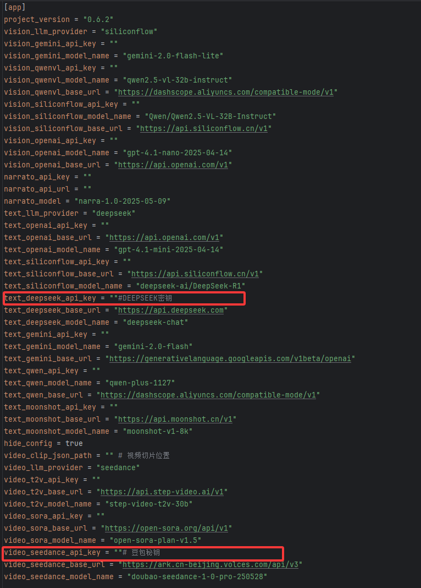
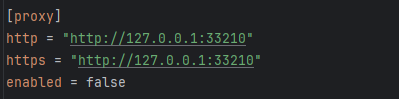
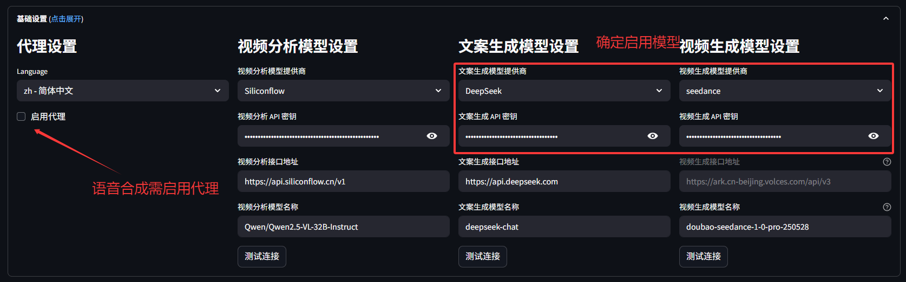
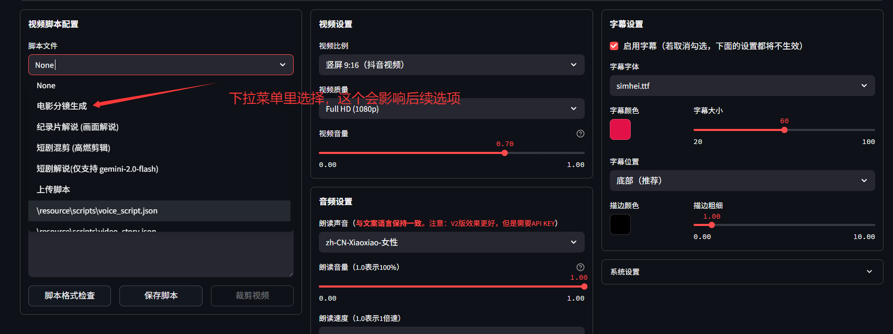
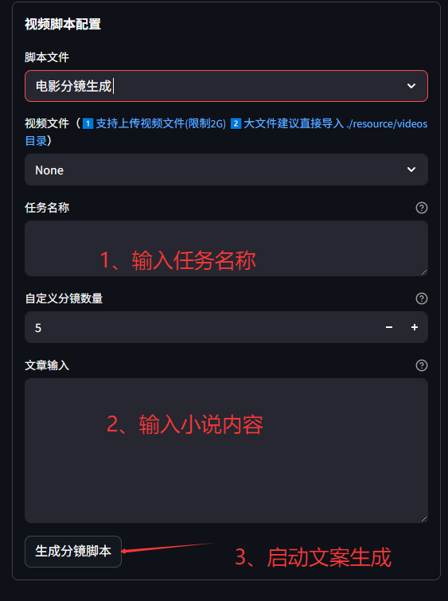
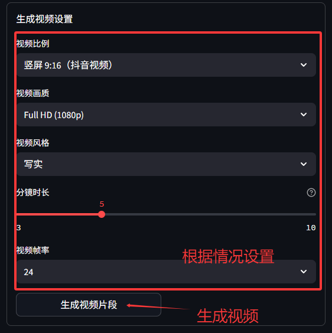
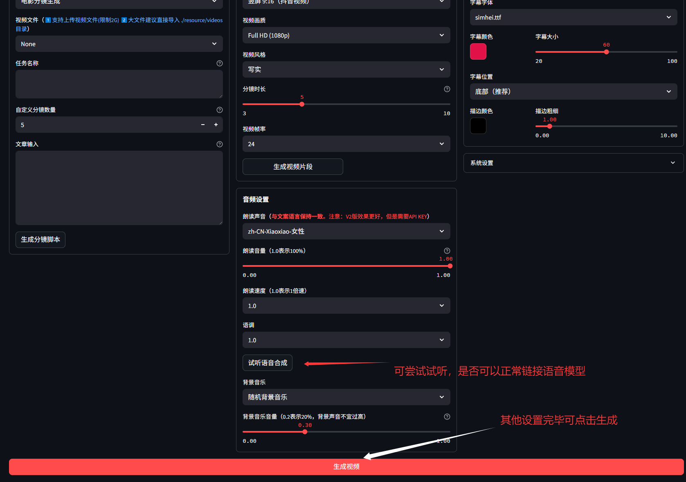

---

---

## 源码部署及使用说明

- Python环境管理工具：`conda`

- python版本：`3.12`

### 1、环境准备

```JSON
# 创建 python 虚拟环境
conda create -n narratoai python=3.12 -y
conda activate narratoai
python -V
```

### 2、安装依赖

```JSON
# 拉取项目
https://github.com/Bagpip/videoAI.git
cd NarratoAI

# 安装依赖
pip install -r requirements.txt
# 使用豆包api需要安装火山大模型依赖
pip install --upgrade "volcengine-python-sdk[ark]"
```

其他依赖项：`ImageMagick`和`FFmpeg`

> `ImageMagick`安装
>
> `链接：https://pan.quark.cn/s/2eb2a60c9489`
>
> `提取码：kwwX`
>
> 安装步骤： 全选默认安装即可

> 1. **下载`FFmpeg`**:
>    1. 访问`FFmpeg`的官方网站（https://ffmpeg.org/download.html）或使用提供的第三方链接，如`gyan.dev`或`BtbN GitHub Releases`，选择适合Windows的预编译版本。推荐选择最新版本，例如6.0或6.1。
>    2. 根据你的系统架构（32位或64位），下载对应的ZIP文件。
> 2. **解压文件**:
>    1. 下载完成后，找到ZIP文件并解压到你希望存放`FFmpeg`的目录，比如`C:\Program Files\ffmpeg`。
> 3. **设置环境变量**:
>    1. 进入解压后的目录，找到`bin`子文件夹，这个文件夹包含了所有可执行文件（如`ffmpeg.exe`）。
>    2. 打开Windows设置，搜索“编辑环境变量”或通过控制面板进入“系统”->“高级系统设置”->“环境变量”。
>    3. 在“用户变量”或“系统变量”中找到“`Path`”，点击“编辑”。
>    4. 点击“新建”，然后输入或粘贴解压后`bin`文件夹的完整路径（例如`C:\Program Files\ffmpeg\bin`），确保没有引号，并以`bin`结尾。
>    5. 点击“确定”保存所有更改。
> 4. **验证安装**:
>    1. 打开命令提示符（CMD）或Windows Terminal，输入`ffmpeg -version`。
>    2. 如果安装成功，系统将显示`FFmpeg`的版本信息，表明`FFmpeg`已经正确安装并添加到系统路径中。

### 3、编辑配置文件

先编辑配置文件`config.example.toml`，但再第一次启动后会基于他生成一个正式的配置文件 `config.toml `，后续只需要编辑` config.toml` 文件即可，最后生效的也是` config.toml`；



文生视频功能主要需要两个模型：文生文，文生视频。这里以`deepseek`和豆包`seedance`为例，需要去官方网站申请`api`密钥。



`proxy`中IP地址后为所使用VPN的端口号，合成语音功能时可能需要打开代理。

### 4、启动

```json
# 启动虚拟环境
conda activate narratoai
# cd到所在目录
cd 你的目录地址\NArratoAI
# 启动
streamlit run webui.py --server.maxUploadSize=2048
```

### 5、基本使用说明

总结为三步：复制小说内容，生成文案-->根据文案生成视频-->合成字幕音频，最终生成视频

- 启用代理，确定端口设置正确，确认所使用模型



- 选择脚本配置文件



- 输入文章内容



- 文案生成完毕后可在`NarratoAI\resource\scripts`中查看生成的脚本，后续生成视频会读取该目录内的脚本

  

- 生成视频完毕后根据情况调整其他设置



- 最后一步生成视频主要进行以下工作：音频合成，字幕生成，`bgm`及相关内容读取，拼接合成最终视频。

